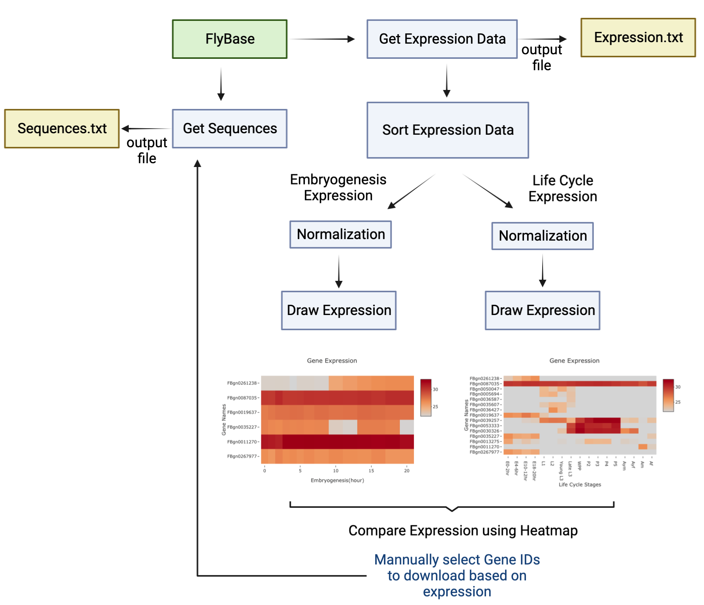
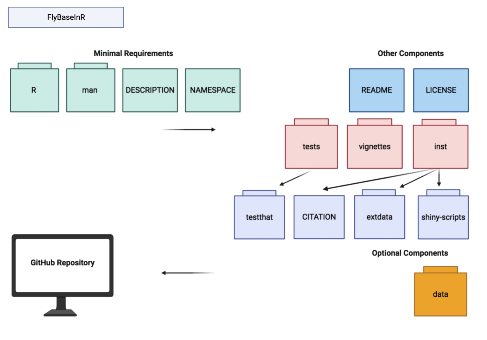

<!-- README.md is generated from README.Rmd. Please edit that file -->

```{r, include = FALSE}
knitr::opts_chunk$set(
  collapse = TRUE,
  comment = "#>",
  fig.path = "man/figures/README-",
  out.width = "100%"
)
```

# FlyBaseInR

<!-- badges: start -->

<!-- badges: end -->

The goal of FlyBaseInR is to extract sequences and expression data of *Drosophila Melanogaster* from FlyBase Application Programming Interface(API), compare and visualize gene expression of embryogenesis stage and the entire life cycle.

## Description

`FlyBaseInR` is an R package focuses on retrieve and analyze expression data of *Drosophila Melanogaster* from FlyBase API, and download one of 10 types of sequences of selected genes for further experimental analysis. The FlyBase is a database for drosophila genetics and molecular biology. It can be searched for genes, alleles, aberrations and other genetic objects, phenotypes, sequences, stocks, images and movies, controlled terms. `FlyBaseInR` focuses on the most widely used species in drosophila genetics: *Drosophila Melanogaster*. FlyBase web database does not allow batch retrieval of gene expression data(label free quantification data from mass spectrometry). `FlyBaseInR` can be used to facilitate expression comparason of a set of genes identified by their FlyBase Gene IDs. By comparing their expression at 10 different timepoint in embryogenesis, or at 15 different stages of fly life cycle, users can draw conclusion of which genes have a higher expression level in which time point or stage, indicating that these genes might have interactions or are regulated under similar regulatory mechanism. The `FlyBaseInR` package was developed using `R version 4.2.0 (2022-04-22)`, `Platform: x86_64-apple-darwin17.0 (64-bit)` and `Running under: macOS Monterey 12.6`.

## Assumption
`FlyBaseInR` assumes that the user input text file is in their working directory, and follows the format requirement in the vingettes. Although the package checks for user faulty input, a correct input format is necessary for retrieving seqeunces, expressio and generating heatmap.

## Installation

To install the latest version of the package:

``` r
require("devtools")
devtools::install_github("CathNiu/FlyBaseInR", build_vignettes = TRUE)
library("FlyBaseInR")
```

To run the Shiny app:

``` r
runFlyBaseInR()
```

## Overview

To view available functions:

``` r
ls("package:FlyBaseInR")
```

`FlyBaseInR` contains functions to:

1.  Parse user input text file to get a list of genes (See function *parseFile*).

2.  Retrieve expression data from FlyBase using a user input text file, and download expression data in a text file (See function *getAllExpression*).

3.  Visualize and compare expression data of a set of genes by embryogenesis or life cycle (See function *drawExpression*).

4.  Download one of 9 types of sequences of selected genes for further experiment or analysis as a text file (See function *getAllSequences*).

To view available datasets:

``` r
data(package = "FlyBaseInR") 
```

To view Vignettes:

``` r
browseVignettes("FlyBaseInR")
```

An overview of the package is illustrated below:



## Contrubutions

The author of the package is Huilin Niu. The *getAllSequences* and *getAllExpression* function makes use of the `httr` package to retrieve sequence from FlyBase API and check its content.The *getAllExpression* function also makes use of the `dplyr` package to manipulate dataframe, and the `utils` package to write to the output text file. The *drawExpression* function makes use of the `stats` package to process dataframe, and the `ployly` package to draw heatmap. The *runFlyBaseInR* function makes use of the `shiny` package to run the Shiny App.

## References

-   BioRender. (2022). Image created by Silva, A. Retrieved December 14, 2022, from <https://app.biorender.com/>
-   Chang W, Cheng J, Allaire J, Sievert C, Schloerke B, Xie Y, Allen J, McPherson J, Dipert A, Borges B (2022). *shiny: Web Application Framework for R*. R package version 1.7.3.9001, <https://shiny.rstudio.com/>.
-   Gramates LS, Agapite J, Attrill H, Calvi BR, Crosby M, dos Santos G Goodman JL, Goutte-Gattat D, Jenkins V, Kaufman T, Larkin A, Matthews B, Millburn G, Strelets VB, and the FlyBase Consortium (2022) FlyBase: a guided tour of highlighted features. Genetics, Volume 220, Issue 4, April 2022, iyac035. <https://flybase.org/>
-   Park T. Bootswatch. (2020). GitHub Repository. <https://github.com/thomaspark/bootswatch>
-   Plotly Technologies Inc. Collaborative data science. Montréal, QC, 2015. <https://plot.ly.>
-   R Core Team (2022). R: A language and environment for statistical computing. R Foundation for Statistical Computing, Vienna, Austria. <https://www.R-project.org/>
-   Wickham H (2022). *httr: Tools for Working with URLs and HTTP*. R package version 1.4.4, <https://CRAN.R-project.org/package=httr>.
-   Wickham H, François R, Henry L, Müller K (2022). dplyr: A Grammar of Data Manipulation. <https://CRAN.R-project.org/package=dplyr>
-   Wickham, H. and Bryan, J. (2019). R Packages (2nd edition). Newton, Massachusetts: O'Reilly Media. <https://r-pkgs.org/>

## Acknowledgements

This package was developed as part of an assessment for 2022BCB410H: AppliedBioinformatics, University of Toronto, Toronto, CANADA. `FlyBaseInR` welcomes issues, enhancement requests, and other contributions. To submit an issue, use the [GitHub issues](https://github.com/CathNiu/FlyBaseInR/issues).

For further information see the vignettes.

## Package Structure

The package structure is illustrated below:


The package tree structure is provided below:
``` r
- FlyBaseInR
  |- FlyBaseInR.Rproj
  |- DESCRIPTION
  |- NAMESPACE
  |- LICENSE
  |- README
  |- data
    |- geneListExample.rda
    |- expressionDataExample.rda
  |- inst
    CITATION
    |- extdata
      |- Overview.png
      |- geneListExample.txt
    |- shiny-scripts 
        |- app.R
  |- man
    |- sortHeatMaoData.Rd
    |- runFlyBaseInR.Rd
    |- parseFile.Rd
    |- getSequence.Rd
    |- getExpressiondf.Rd
    |- getExpression.Rd
    |- getAllSequences.Rd
    |- getAllExpression.Rd
    |- geneListExample.Rd
    |- expressionDataExample.Rd
    |- drawExpression.Rd
  |- R
    |- data.R
    |- drawExpression.R
    |- getAllExpression.R
    |- getAllSequences.R
    |- parseFile.R
    |- runFlyBaseInR.R
  |- vignettes
    |- Introduction_FlyBaseInR.Rmd
  |- tests
    |- testthat.R
    |- testthat
      |- test-drawExpression.R
      |- test-getAllExpression.R
      |- test-getAllSequences.R
      |- test-parseFile.R
      |- FBppSequencesCorrect.txt
      |- ExpressionCorrect.txt
      
```
