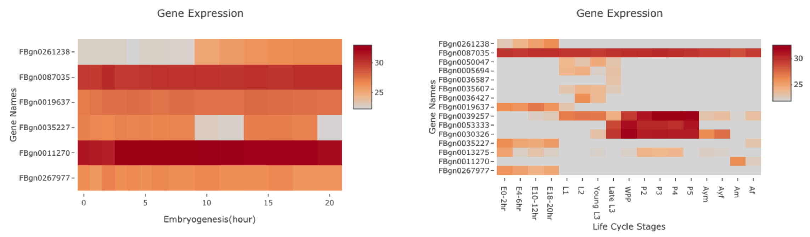

```{r setup, include=FALSE}
library(knitr)
opts_chunk$set(fig.align = "center", 
               out.width = "90%",
               fig.width = 6, fig.height = 5.5,
               dev.args=list(pointsize=10),
               par = TRUE, # needed for setting hook 
               collapse = TRUE, # collapse input & ouput code in chunks
               warning = FALSE)
knit_hooks$set(par = function(before, options, envir)
  { if(before && options$fig.show != "none") 
       par(family = "sans", mar=c(4.1,4.1,1.1,1.1), mgp=c(3,1,0), tcl=-0.5)
})
set.seed(1) # for exact reproducibility
```

## Introduction

`FlyBaseInR` is an R package focuses on retrieve and analyze expression
data of *Drosophila Melanogaster* from FlyBase API, and download one of
10 types of sequences of selected genes for further experimental
analysis. The FlyBase is a database for drosophila genetics and
molecular biology. It can be searched for genes, alleles, aberrations
and other genetic objects, phenotypes, sequences, stocks, images and
movies, controlled terms. `FlyBaseInR` focuses on the most widely used
species in drosophila genetics: *Drosophila Melanogaster*. FlyBase web
database does not allow batch retrieval of gene expression data(label
free quantification data from mass spectrometry). `FlyBaseInR` can be
used to facilitate expression comparason of a set of genes identified by
their FlyBase Gene IDs. By comparing their expression at 10 different
timepoint in embryogenesis, or at 15 different stages of fly life cycle,
users can draw conclusion of which genes have a higher expression level
in which time point or stage, indicating that these genes might have
interactions or are regulated under similar regulatory mechanism. **This
document gives a tour of FlyBaseInR (version 0.1.0)**. It was written in
R Markdown, using the [knitr](https://cran.r-project.org/package=knitr)
package for production. See `help(package = "FlyBaseInR")` for further
details.

To download **FlyBaseInR**, use the following commands:

``` r
require("devtools")
devtools::install_github("CathNiu/FlyBaseInR", build_vignettes = TRUE)
library("FlyBaseInR")
```

To list all sample functions available in the package:

``` r
ls("package:FlyBaseInR")
```

To list all sample datasets available in the package:

``` r
data(package = "FlyBaseInR")
```

## Application

Let's go thorough an example of how this package can be used to analyze
a set of genes.

First, we need to parse the text file using *parseFile* function. The
example txt file is located under inst/extdata folder under FlyBaseInR
pacakge folder or you can access the example by [this
link](https://github.com/CathNiu/FlyBaseInR/blob/232f650d706a0ec45b987968eeee925c3562c789/inst/extdata/geneListExample.txt).
The file needs to be a text file ends with .txt, and each line should
only contain one FlyBase Gene ID without extra spacing. Make sure the
file is saved in your current working directory.

To parse the text file, run:

``` r
yourGeneList <- FlyBaseInR::parseFile(geneFile = "geneListExample.txt")
```

After running, view *yourGeneList* should produce an identical list as
*geneListExample* when you run *parseFile* on "geneListExample.txt":

``` r
View(yourGeneList)
View(geneListExample)
```

Next, we will extract expression from FlyBase using *getAllExpression*
function. This function will retrieve expression data acccording to
given gene IDs from FlyBase, and output a text file containing all
avialable expression for your record in your current working directory.
You can open the text file as Excel for better visuallization if you
would like to visualize the data before proceeding to the next step. The
function also returns a dataframe containing the same expression data as
the text file described previously, and we will use this in the next
step.

``` r
yourExpressionData <- FlyBaseInR::getAllExpression(geneList = yourGeneList)
```

After running, view *yourExpressionData* should produce an identical
list as *expressionDataExample* when you run *getAllExpression* on the
*geneList* generated from "geneListExample.txt":

``` r
View(yourExpressionData)
View(expressionDataExample)
```

Next, we will continue to draw expression using *yourExpressionData*.
The function takes three arguments, *expressionData* is the input
expression dataframe, *typeGraph* indicates which type of graph you
would like to generate(You can choose from "Embryogenesis" or
"LifeCycle"), and *graphTitle* is the title of your graph. Note that, some genes might not have a high enough expression level during embryogenesis, and the function skips the genes that does not have embryogensis expression. Thus sometimes, less genes are shown in the embryogenesis expression plot. Run the R code below to get the graphs. Please type help(drawExpression) to see a complete list of abbreviations and their corresponding stages.

``` r
# To draw the embryogenesis expression data at each time point in the first 20 hours
FlyBaseInR::drawExpression(expressionData = yourExpressionData,
                           typeData = "Embryogenesis", 
                           graphTitle = "Gene Expression Heatmap Example")

# To draw the life cycle expression data at each developmental stages
FlyBaseInR::drawExpression(expressionData = yourExpressionData,
                           typeData = "LifeCycle", 
                           graphTitle = "Gene Expression Heatmap Example")                         
```

Now, you should see a heatmap in the view panel in your R studio. You
can hover over the unit cell to see the gene id, the time point in
embryogenesis/developmental stage in life cycle, and the intensity of expression after log2 transformation. Please see below for the examples(left: embryogenesis expression, right: life cycle expression). 

<div style="text-align:center">

The color scale on the right shows the expression level, the darker the color, the higher the expression level. If you take a closer look at the left image, you can conclude that expression level of FBgn0261238 increase along embryogesis, indicating it is upregulated at later embryogenesis. Expression level of FBgn0011270 is constantly high, indicating it could be an important protein involved in development. If you take a look at the life cycle expression on the right, you can conclude that FBgn0039257, FBgn0053333, FBgn0030206 have high expressions at pupal stages, indicating they might be involved in the same biological process or upregulated by the same regulatory mechanism. Also, FBgn0261238, FBgn0019637, FBgn0035227, FBgn0267977 might be involved in embryogenesis together. These information could be useful to explore in experiments to investigate their function. 

Finally, after identified the genes of interest, you can put the genes into a list, and use *getAllSequences* function to retrieve one of ten types of seqeunces you want from FlyBase. To see all available input of *seqType*, type help(getAllSequences) to see a full list of available sequence types. The output will be in a text file ends with "Sequences.txt" in your working directorry.

``` r

interestingGenes <- c("FBgn0261238", "FBgn0019637", "FBgn0035227", "FBgn0267977")
getAllSequences(geneList = interestingGenes,
                seqType = "CDS")
                
```

## Minimal requirements

-   The **R subdirectory**
-   The **man subdirectory**
-   **DESCRIPTION** file
-   **NAMESPACE** file

### Other

-   **README** file
-   **LICENSE** file
-   The **data** subdirectory
-   The **tests** subdirectory
-   The **vignettes** subdirectory
-   The **inst** subdirectory

## Package References

Niu, H. (2022) FlyBaseInR: An R package that retrieve, analyze and draw
data from FlyBase API.Unpublished. URL:
<https://github.com/CathNiu/FlyBaseInR>.

## Other References

-   BioRender. (2022). Image created by Silva, A. Retrieved December 14,
    2022, from <https://app.biorender.com/>
-   Chang W, Cheng J, Allaire J, Sievert C, Schloerke B, Xie Y, Allen J,
    McPherson J, Dipert A, Borges B (2022). *shiny: Web Application
    Framework for R*. R package version 1.7.3.9001,
    <https://shiny.rstudio.com/>.
-   Gramates LS, Agapite J, Attrill H, Calvi BR, Crosby M, dos Santos G
    Goodman JL, Goutte-Gattat D, Jenkins V, Kaufman T, Larkin A,
    Matthews B, Millburn G, Strelets VB, and the FlyBase Consortium
    (2022) FlyBase: a guided tour of highlighted features. Genetics,
           Volume 220, Issue 4, April 2022, iyac035.
           <https://flybase.org/>
-   Park T. Bootswatch. (2020). GitHub Repository.
    <https://github.com/thomaspark/bootswatch>
-   Plotly Technologies Inc. Collaborative data science. Montréal,
    QC, 2015. <https://plot.ly.>
-   R Core Team (2022). R: A language and environment for statistical
    computing. R Foundation for Statistical Computing, Vienna, Austria.
    <https://www.R-project.org/>
-   Wickham H (2022). *httr: Tools for Working with URLs and HTTP*. R
    package version 1.4.4, <https://CRAN.R-project.org/package=httr>.
-   Wickham H, François R, Henry L, Müller K (2022). dplyr: A Grammar of
    Data Manipulation. <https://CRAN.R-project.org/package=dplyr>
-   Wickham, H. and Bryan, J. (2019). R Packages (2nd edition). Newton,
    Massachusetts: O'Reilly Media. <https://r-pkgs.org/>
