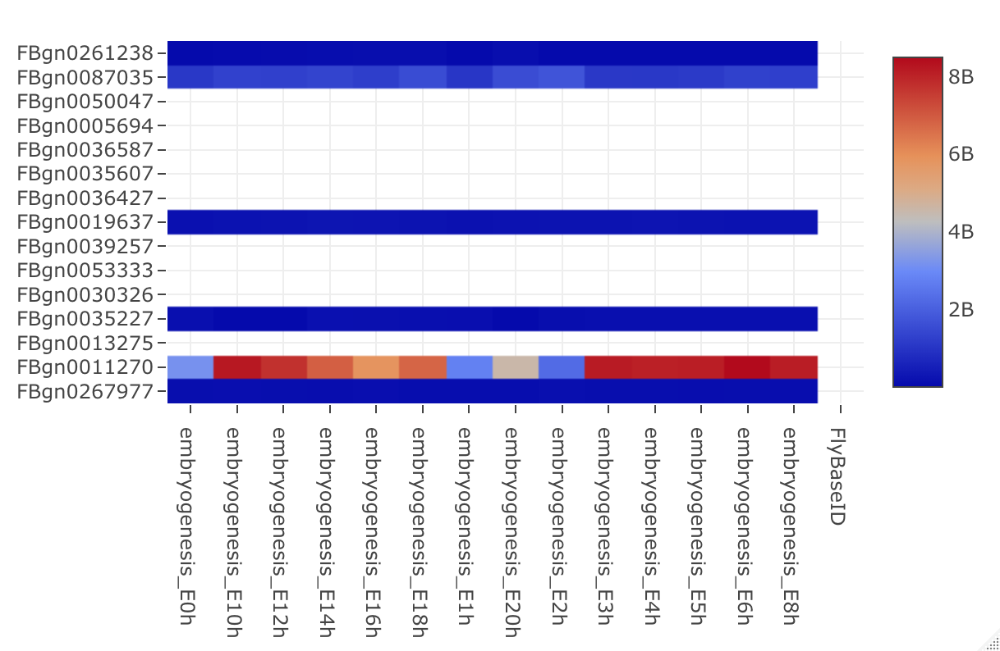

```{r, include = FALSE}
knitr::opts_chunk$set(
  collapse = TRUE,
  comment = "#>"
)
```

# Overview

This package provides the user the means to retract genes sequences, and 
compare gene expression across developmental stages in FlyBase API. There are 
three functions exported, the users will mainly use getAllSequences(), 
getAllExpression() for information extraction, and drawExpression() for 
expression comparison. 


# Plotly Graph

The plotly graph allows the user to compare expression level of genes across 
different genes visually. 

# Draw Expression

The simplest usage of the `drawExpression()` function is to provide it a 
text file containing gene ids of FlyBase ID, and select expression stages from
Embryogenesis and Life Cycle to draw.

This code can then be used as shown below. For this example, we will use 
geneList.txt in tests folder.

```r
FlyBaseInR::drawExpression("tests/geneList.txt", "Embryogenesis")
```
This function will then search the FlyBase database, retrieve json data format, 
parse the data, make a dataframe of all expression levels LFQ from all 
developmental stages, as specified in the API, and then draw embryogenesis 
expression in a format of heatmap.

The output to this function should look something like this



This code shown below is the function for sequence retrieval. You can enter
the following sequence types in SEQUENCETYPE as stirng. 
                  
```r
SEQUENCETYPE <- c("FBgn", "FBtr", "FBpp", "FBcl", "FBsf", "FBti", "FBtp",
                  "exon", "intron", "five_prime_utr", "three_prime_utr", "CDS")
FlyBaseInR::getAllSepuences("tests/geneList.txt", "FBpp")
```
This function will output a text file "FBppSequences.txt". in working directory.


This code shown below is the function for expression level retrieval
                  
```r
FlyBaseInR::getAllExpression("tests/geneList.txt")
```
This function will output a text file "Expression.txt". in working directory.

